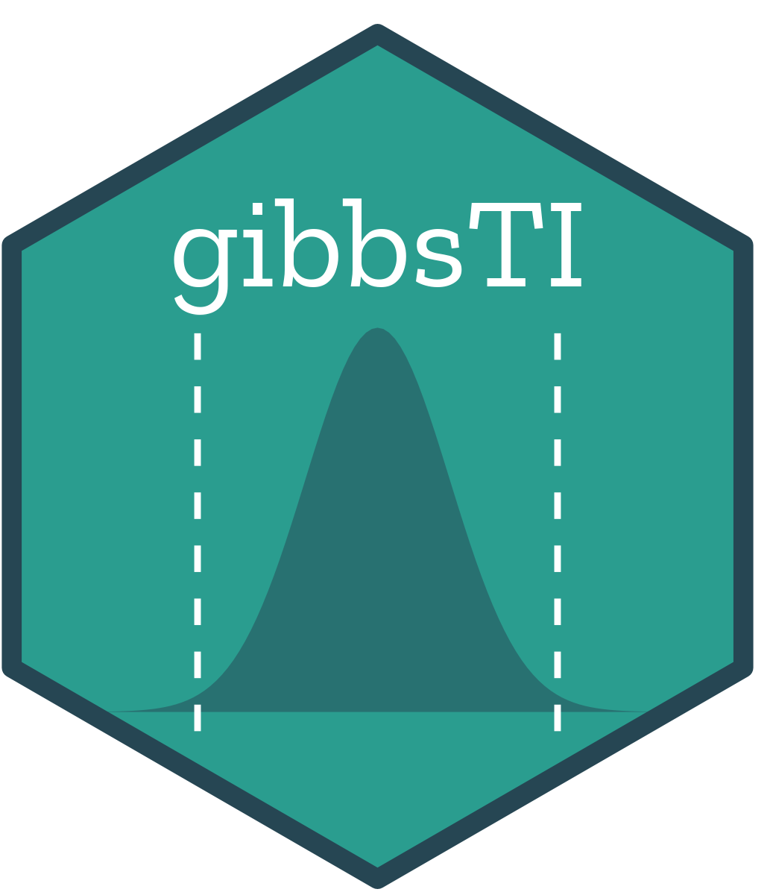

# gibbsTI 

### R Package: Calibrated Gibbs Posteriors for Tolerance Intervals

[](https://www.repostatus.org/#active)

**gibbsTI** provides tools for constructing one-sided and two-sided nonparametric tolerance intervals using calibrated Gibbs posteriors.

> ⚠️ **Note:** This package is currently under active development. The API is subject to change, and you may encounter bugs. Please report any issues or feedback via the [GitHub Issue Tracker](https://github.com/tpourmohamad/gibbsTI/issues).

---

## Installation

You can install the development version of **gibbsTI** from GitHub. 

### 1. Prerequisites
Since you are installing from source, ensure you have a functional build environment:
* **Windows:** [Rtools](https://cran.r-project.org/bin/windows/Rtools/)
* **macOS:** Xcode command line tools

### 2. Install via `remotes`
Run the following commands in your R console:

```R
# Install the remotes package if you don't have it
if (!requireNamespace("remotes", quietly = TRUE)) {
  install.packages("remotes")
}

# Install gibbsTI
remotes::install_github("tpourmohamad/gibbsTI")
```

---

## Usage

```R
library(gibbsTI)

set.seed(1)
x <- rnorm(50)

# One-sided upper 95% content / 90% confidence tolerance interval,
# with the Gibbs learning rate chosen by GPC calibration (the default).
fit <- gibbsTI(x, side = "one", type = "upper",
               content = 0.95, confidence = 0.90)
print(fit)
summary(fit)
plot(fit)

# Two-sided interval
fit2 <- gibbsTI(x, side = "two", content = 0.95, confidence = 0.90)
summary(fit2)

# Skip calibration and use a fixed learning rate
fit3 <- gibbsTI(x, side = "one", type = "upper",
                eta_method = "fixed", eta = 1)
```

---

## Citation

If you use **gibbsTI**, please cite:

> Pourmohamad, T., Richardson, R., & Sansó, B. (2026).
> "Calibrated Bayesian Nonparametric Tolerance Intervals." *Technometrics*, 1–27.
> <https://doi.org/10.1080/00401706.2026.2699103>

You can also run `citation("gibbsTI")` in R.
